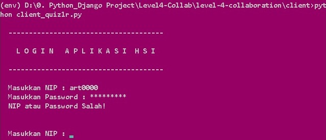
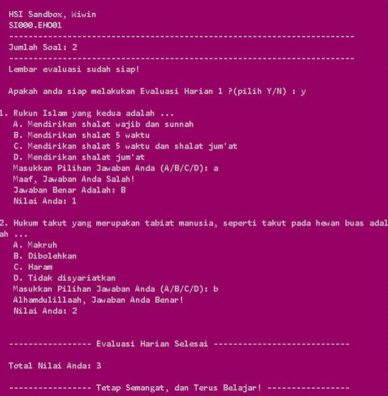
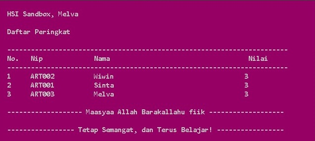

# Quiz 4 Collaboration (Aplikasi Evaluasi Harian HSI dengan Menggunakan Django dan database MySQL berbasis CMD)

## **Project Summary**
This application uses a client server system built with the Django framework, user as an admin can manage the data that will be used as quiz material or data from the responses of participants.  
  
---

## **CMD App**    

## 1. Login screen
  User will be asked to enter their ID and Password
  - User is an **Admin**: a message will appear so that the admin can access the web admin
  - User is a **Participant**: if the NIP and Password are correct, the participant will be confirmed to work on the evaluation question    
-    
  
## 2. Running quiz
  - Participants will be asked to enter 'y' to continue the quiz, or 'n' to return
  each daily evaluation will give 2 questions randomly from the question bank
  - The evaluation questions will immediately be checked whether they are true or false, if **True** they will get **2 score**, and if **Wrong** they get a **1 score**.
  - The evaluation value will be displayed after the participant completes the evaluation   
-    

## 3. Hasil evaluasi
  - Participants can see their evaluation result
- 

## 4. Daily evaluation done
  - 
- 

---

## **Admin Web**
1. ## Login screen
2. ## Peringkat peserta
---

## **Who can access this app?**
-

---
## **How the App works**
  
To run this project, first, you should start by having Python installed on your computer. It's advised you create a env to store your project dependencies separately. You can install env with the following command:  
  ```python
    python -m venv env
  ```
if you have multiple versions of python, you can specify them by calling the version
  ```python
    python`version` -m venv env
  ```

then you can activate the env with
  
  ```python
    Linux = source env/bin/activate
    Windows = source env/Scripts/activate
  ```
You need pip to install Python packages, this package will manage and help this project to run. You can install pip with the following command:
  
  ```python
    pip install -r requirements.py
  ```

or you can install per package:

- Client :
  - `pwinput`                                                                           
  - `requests`

- Server :
  - `django`
  - `mysqlclient`
  - `wheel (for python version <= 3.7)`

how to install :
```python
  pip install -package name
```

---

**Our Team Members:**
- Ketua: Wiwin Mafiroh

- Sinta
- Melva
- Novi
- Aqilah